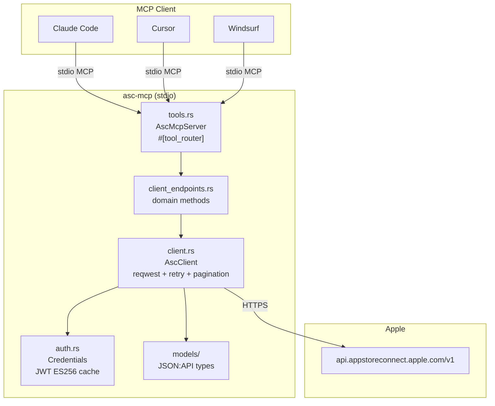
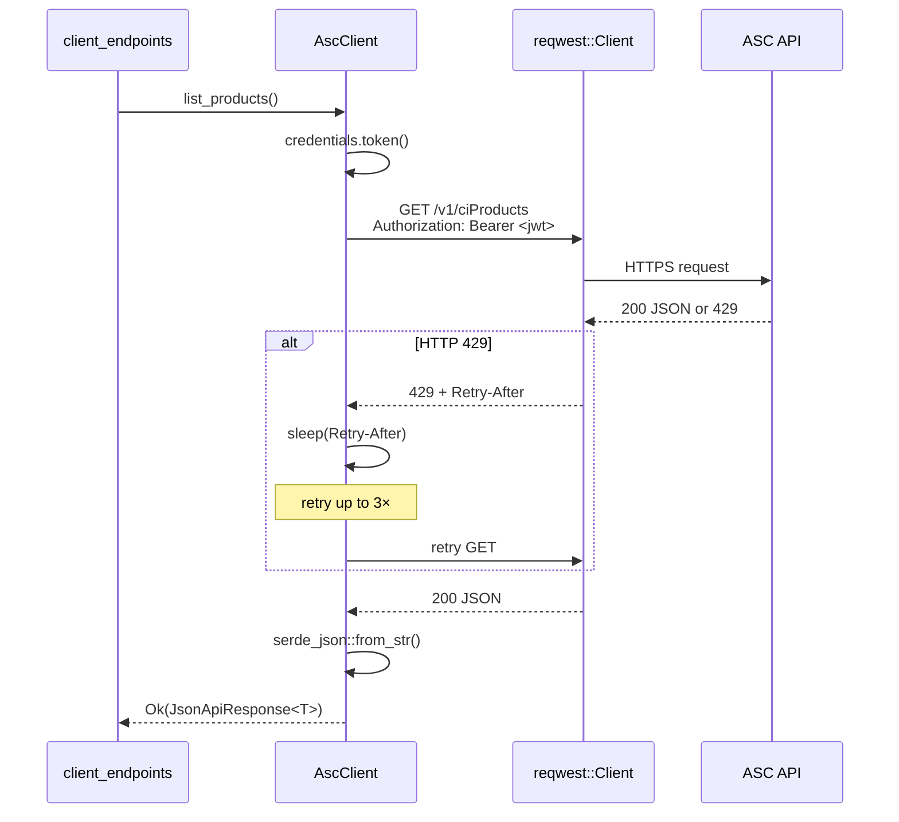
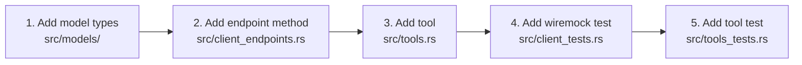

# Architecture

## System Overview

`asc-mcp` is a single-binary stdio MCP server in Rust. It translates MCP tool calls into App Store Connect API requests and returns structured JSON results.



---

## Module Breakdown

### `auth` — JWT ES256

Generates tokens per [Apple's JWT spec](https://developer.apple.com/documentation/appstoreconnectapi/generating-tokens-for-api-requests):

```
Header:  { "alg": "ES256", "kid": "<KEY_ID>",    "typ": "JWT" }
Payload: { "iss": "<ISS>",  "iat": <now>,         "exp": <now+20m>, "aud": "appstoreconnect-v1" }
```

```mermaid
stateDiagram-v2
    [*] --> NoToken
    NoToken --> Signing: Credentials::token()
    Signing --> Cached: JWT written to Mutex cache
    Cached --> Cached: elapsed < 15min → return cached
    Cached --> Signing: elapsed ≥ 15min → regenerate
```

**Key types:**
- `Credentials` — holds `key_id`, `issuer_id`, `key_pem`, and `Mutex<Option<CachedToken>>`
- `CachedToken` — wraps the JWT string + `Instant` of creation

15-minute TTL (Apple max 20m) gives a 5-minute buffer for clock skew.

---

### `client` — HTTP Transport



Three cross-cutting behaviors:
1. **Auth injection** — every request gets `Bearer <jwt>` from `Credentials::token()`
2. **Rate-limit retry** — 429 → read `Retry-After` → sleep → retry (max 3x)
3. **Pagination** — `get_all_pages()` follows `links.next` until exhausted

`get_raw()` is a separate path for binary endpoints (sales reports) — returns `Vec<u8>` with custom `Accept` header.

---

### `client_endpoints` — Domain Methods

Thin `impl AscClient` — one method per ASC endpoint. Keeps transport concerns separate from domain logic.

| Method | HTTP | ASC endpoint |
|---|---|---|
| `list_products` | GET | `/ciProducts` |
| `get_product` | GET | `/ciProducts/{id}` |
| `list_workflows` | GET | `/ciProducts/{id}/workflows` |
| `list_build_runs` | GET | `/ciWorkflows/{id}/buildRuns` |
| `get_build_run` | GET | `/ciBuildRuns/{id}` |
| `start_build` | POST | `/ciBuildRuns` |
| `list_build_actions` | GET | `/ciBuildRuns/{id}/actions` |
| `list_apps` | GET | `/apps` |
| `get_app` | GET | `/apps/{id}` |
| `list_customer_reviews` | GET | `/apps/{id}/customerReviews` |
| `get_sales_report` | GET | `/salesReports` (gzip TSV) |

---

### `tools` — MCP Tool Router

Uses `rmcp` proc-macros:
- `#[tool_router]` — generates the `ToolRouter<AscMcpServer>` at compile time
- `#[tool]` — registers each async method as a named MCP tool with its JSON Schema
- `#[tool_handler]` — wires `ServerHandler::call_tool()` to the router

Each tool method:
1. Deserializes params from MCP JSON into `#[derive(Deserialize, JsonSchema)]` struct
2. Calls the matching `AscClient` method
3. Serializes the result as pretty JSON in `CallToolResult::success()`

---

### `models` — JSON:API Types

Generic envelope covering all ASC responses:

```rust
JsonApiResponse<T>   // { data: T, links: Option<PagedDocumentLinks> }
Resource<A>          // { id, type, attributes: A }
```

Domain modules:

```
models/
├── common.rs   JsonApiResponse, Resource, PagedDocumentLinks
├── ci.rs       CiProduct, CiWorkflow, CiBuildRun, CiBuildAction, CiArtifact
│               ExecutionProgress, CompletionStatus, ActionType enums
├── app.rs      App, CustomerReview, CustomerReviewResponse
├── sales.rs    SalesReportRow + gzip TSV parser (flate2 + csv)
└── scm.rs      ScmGitReference
```

All enums include `#[serde(other)] Unknown` to avoid panics on new Apple API values.

---

## Design Decisions

### Why stdio transport?

The MCP spec supports both stdio and HTTP. Stdio is the universal default: no port management, works identically in local and CI environments, every MCP client supports it out of the box.

### Why `wiremock` for tests?

Integration tests hit a real HTTP stack — including header parsing, status codes, and JSON deserialization — without requiring Apple credentials or network access. This catches classes of bugs unit tests miss (e.g., wrong `Retry-After` header parsing, pagination edge cases).

### Why split `client.rs` / `client_endpoints.rs`?

`client.rs` owns cross-cutting transport behaviors (retry, pagination, auth). `client_endpoints.rs` owns the domain model. New endpoints never touch the transport; transport fixes never touch endpoints. Both stay under 300 lines.

### Why `Arc<Credentials>`?

`AscClient` can be cloned across concurrent tool calls. Sharing credentials via `Arc` ensures the JWT cache is effective — a single token serves all concurrent requests until it expires.

### Why `Mutex` for the JWT cache?

Token generation is fast (< 1ms). A `Mutex` is simpler and more predictable than `RwLock` for a value that's almost always just read. The brief write lock on token refresh has no practical impact.

---

## Adding a New Resource


