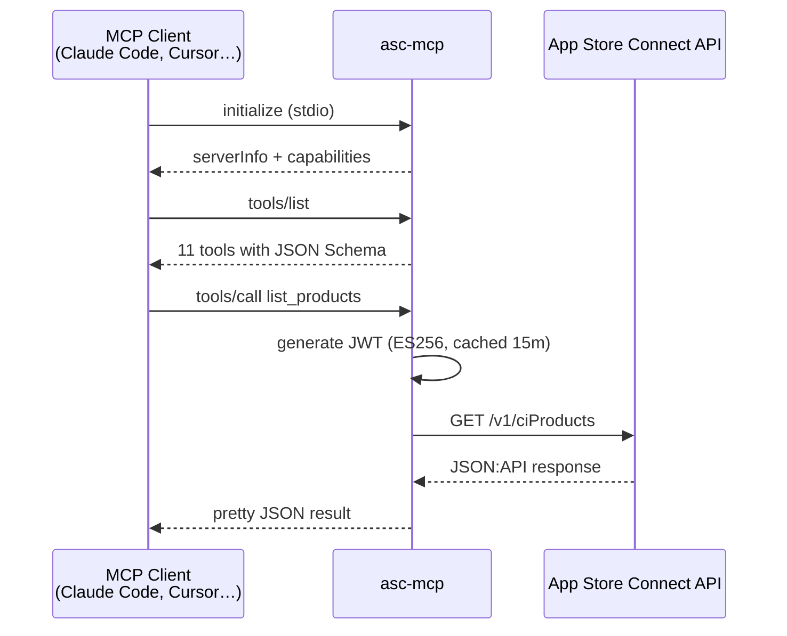
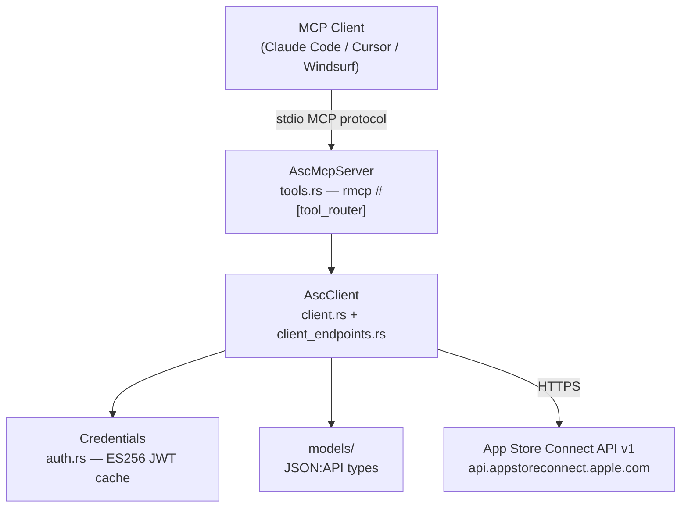
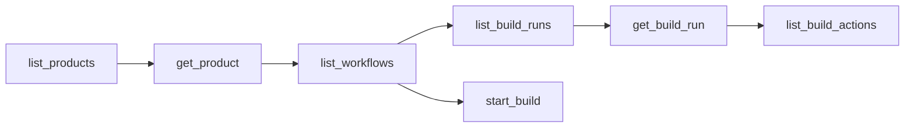
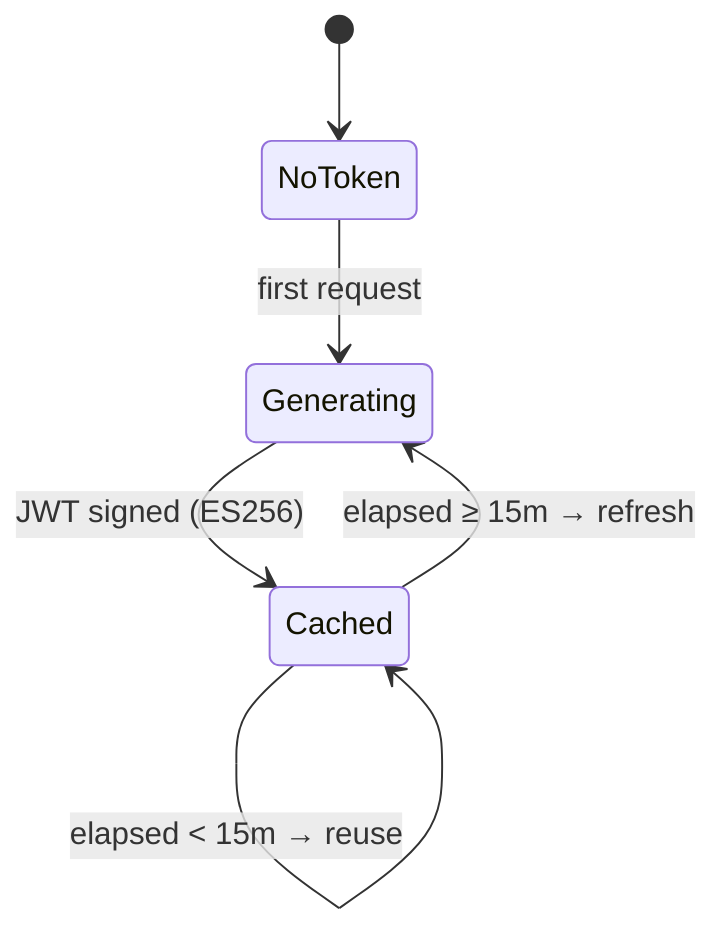

> ⚠️ **Read-only mirror.** Source of truth: [`menot-you/nott`](https://github.com/menot-you/nott) at `mcps/apple-store-connect/`. Open issues, PRs, and releases in the monorepo — pushes here are overwritten by the mirror.

<div align="center">


# Apple Store Connect

[](https://docs.rs/nott-mcp-asc)
[](https://crates.io/crates/nott-mcp-asc)
[](https://www.rust-lang.org)
[](LICENSE)
[](https://modelcontextprotocol.io)

MCP server for the Apple App Store Connect API — Xcode Cloud CI, app management, customer reviews, and sales reports.

Works with Claude Code, Cursor, Windsurf, and any [MCP](https://modelcontextprotocol.io)-compatible client.

</div>

---

## How it works



---

## Architecture



---

## Features

- **Xcode Cloud CI/CD** — list products, workflows, build runs, actions; trigger builds
- **App management** — list and inspect apps
- **Customer reviews** — fetch with full auto-pagination
- **Sales reports** — download and parse gzip-compressed TSV reports
- **JWT auth** — ES256 tokens generated and cached for 15 minutes
- **Rate-limit handling** — automatic retry with `Retry-After` respect (3 attempts)
- **Zero config** — three env vars and you're running

---

## Installation

```bash
cargo install nott-mcp-asc
```

Or via npm (runs native binary):

```bash
```

Or via pip:

```bash
```

Or build from source:

```bash
git clone https://github.com/menot-you/mcp-asc
cd apple-store-connect
cargo install --path .
```

---

## Configuration

Generate an API key at [App Store Connect → Users and Access → Integrations → App Store Connect API](https://appstoreconnect.apple.com/access/integrations/api).

| Variable | Description |
|---|---|
| `ASC_KEY_ID` | Key ID shown in App Store Connect |
| `ASC_ISSUER_ID` | Issuer ID shown at the top of the API keys page |
| `ASC_PRIVATE_KEY_PATH` | Path to the `.p8` file downloaded from App Store Connect |

---

## Usage

### Claude Code

Add to `~/.claude/claude_desktop_config.json`:

```json
{
  "mcpServers": {
    "asc-mcp": {
      "command": "asc-mcp",
      "env": {
        "ASC_KEY_ID": "YOUR_KEY_ID",
        "ASC_ISSUER_ID": "YOUR_ISSUER_ID",
        "ASC_PRIVATE_KEY_PATH": "/path/to/AuthKey_XXXX.p8"
      }
    }
  }
}
```

### Cursor / Windsurf / other MCP clients

Same structure — add to your client's MCP server config file.

---

## Available Tools

### Xcode Cloud



| Tool | Parameters | Description |
|---|---|---|
| `list_products` | — | List all Xcode Cloud CI products |
| `get_product` | `product_id` | Get details of a specific CI product |
| `list_workflows` | `product_id` | List workflows for a CI product |
| `list_build_runs` | `workflow_id` | List build runs for a workflow |
| `get_build_run` | `build_run_id` | Get details of a specific build run |
| `start_build` | `workflow_id`, `git_reference_id` | Trigger a new build |
| `list_build_actions` | `build_run_id` | List actions inside a build run |

### Apps & Reviews

| Tool | Parameters | Description |
|---|---|---|
| `list_apps` | — | List all apps in App Store Connect |
| `get_app` | `app_id` | Get details of a specific app |
| `list_customer_reviews` | `app_id` | List customer reviews for an app |

### Sales Reports

| Tool | Parameters | Description |
|---|---|---|
| `get_sales_report` | `vendor_number`, `report_type`, `report_sub_type`, `frequency`, `report_date` | Download and parse a sales report |

`report_type` values: `SALES`, `SUBSCRIPTION`, `SUBSCRIPTION_EVENT`
`frequency` values: `DAILY`, `WEEKLY`, `MONTHLY`, `YEARLY`
`report_date` format: `YYYY-MM-DD`

---

## Token lifecycle



Apple allows 20-minute tokens; this server uses 15-minute TTL for a 5-minute clock-skew buffer.

---

## Development

```bash
cargo test          # 47 tests, no credentials needed
cargo clippy -- -D warnings
cargo fmt --check
cargo doc --no-deps
```

Tests use [`wiremock`](https://github.com/LukeMathWalker/wiremock-rs) for real HTTP-level mocking — no Apple account required.

See [CONTRIBUTING.md](CONTRIBUTING.md) for the full guide and [ARCHITECTURE.md](ARCHITECTURE.md) for the design walkthrough.

---

## License

[Apache-2.0](LICENSE) — see the [LICENSE](LICENSE) file for details.
